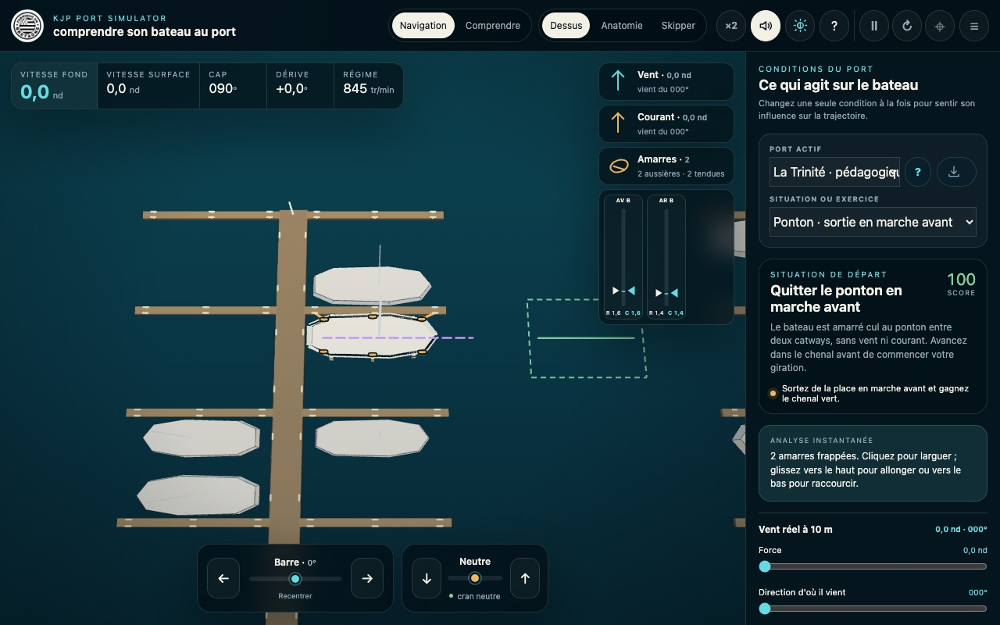

# KJP Port Simulator

KJP Port Simulator réunit deux outils complémentaires :

- `simulateur-port.html`, un simulateur pédagogique de manœuvre au moteur pour voilier habitable ;
- `generateur-port.html`, un éditeur cartographique permettant de créer et modifier des ports au format communautaire KJP.

Les deux livrables sont des fichiers HTML autonomes. Le simulateur fonctionne hors ligne. Le générateur reste utilisable localement, mais la recherche de lieux et les fonds cartographiques nécessitent une connexion Internet.



## Essayer immédiatement
https://arnaud2moissac.github.io/KJP_Port_Simulator/simulateur-port.html

ou
1. Téléchargez ou clonez le dépôt.
2. Ouvrez `simulateur-port.html` dans un navigateur récent.
3. Choisissez une situation ou un défi, larguez les aussières si nécessaire, puis manœuvrez avec les flèches ou les commandes tactiles.

Le [guide utilisateur](docs/guide-utilisateur.md) présente la prise en main, les aussières et les principes du moteur physique sans répéter toute l'interface.

Pour créer un port, ouvrez `generateur-port.html`, dessinez ou analysez une zone OpenStreetMap, définissez son entrée, puis exportez un fichier `.kjp`. La structure du format est décrite dans [ports/KJP.md](ports/KJP.md).

https://arnaud2moissac.github.io/KJP_Port_Simulator/generateur-port.html


## Développer

Prérequis : Node.js 20 ou plus récent.

```bash
npm ci
npm run build:simulator
npm run build:port-generator
npm run verify:release
```

Les fichiers HTML à la racine sont générés. Les modifications se font dans `src/`, puis sont intégrées par les scripts de build. Consultez [CONTRIBUTING.md](CONTRIBUTING.md) avant de proposer une évolution.

## Versions de la release 1.0

- produit : `1.0.0` ;
- moteur physique : `5.1.0` ;
- profil pédagogique Sun Odyssey 36i : `5.2.0` ;
- générateur et schéma KJP courant : `1.0.0` et schéma `2`.

Ces numéros évoluent séparément : une amélioration scientifique du moteur ne change pas nécessairement le format des ports.

## Licence et prudence

Le projet est distribué sous [licence Apache 2.0](LICENSE). Il s'agit d'un outil pédagogique, pas d'un simulateur certifié ni d'un substitut à l'entraînement avec un moniteur et un équipage réel.
