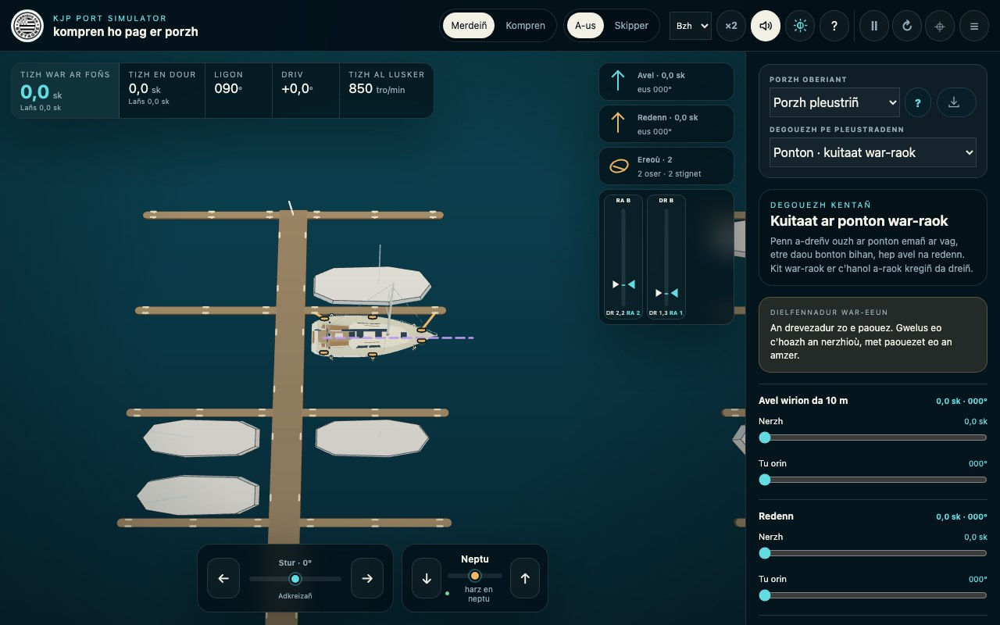
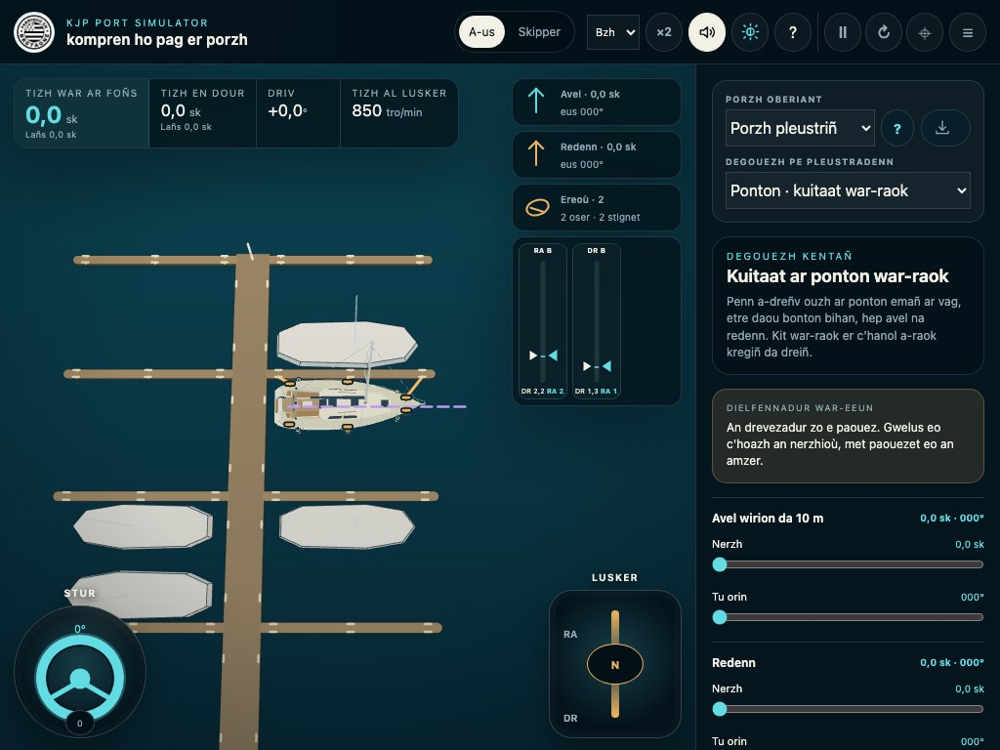
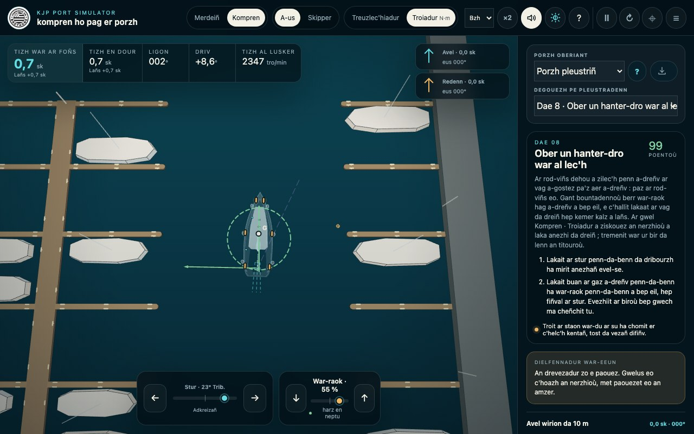
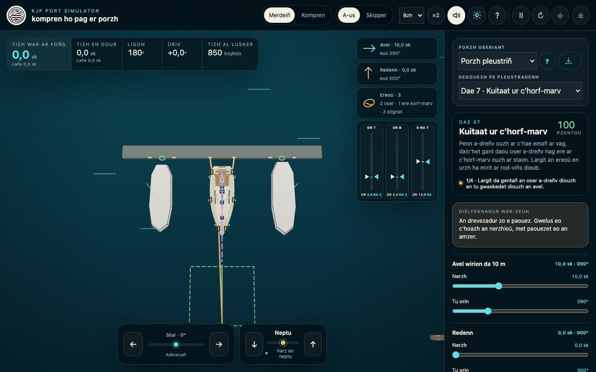

# Deleviañ er porzh gant KJP Port Simulator

Gant KJP Port Simulator e c'hallit klask un deleviadenn, evezhiañ respont ar vag hag adkregiñ kement gwech ha ma vez ezhomm. Sikour a ra da gemer boazioù pa vez izel an tizh, met ne gemer ket plas ur c'helenner na hini ar pleustriñ evezhiek war ho pag.

## Anavezout an etrefas

E kreiz ar prenestr e weler ar porzh hag ar vag. En nec'h a-gleiz e tiskouez ar binvioù an tizhoù, al ligon, an driv ha tizh al lusker. Ar vandenn en nec'h a ro digor d'ar gwelioù, d'ar mod **Kompren**, d'ar son, d'an neuz sklaer pe teñval, d'ar skoazell-mañ, d'ar paouez, d'an adkregiñ ha d'an adkreizañ ar c'hamera.

Ar banell a-zehou a stroll ar porzh oberiant, an degouezh pe ar bleustradenn, ar c'huzulioù, an dielfennadur war-eeun, an avel hag ar redenn. Ar bouton `☰` a ziskouez pe a guzh anezhi. War un dabletezenn pe ur pellgomzer e tigor a-us d'ar gwel evit lezel muioc'h a lec'h d'an deleviadenn.

**Gwel war urzhiataer, gant ar reolerezhioù dindan ar vag :**

## Dibab ar reolerezhioù diouzh ho skramm

Ar dibaber `FR / EN / Bzh` er vandenn en nec'h a cheñch diouzhtu yezh an etrefas hag ar sturlevr-mañ : galleg, saozneg pe brezhoneg. **Bzh** a dalvez **Brezhoneg**. Er gweladenn gentañ e vez implijet ur yezh skoret eus ho merdeer, pe ar galleg ma n'eus hini dereat ebet. Miret eo ho tibab pa vez hegerz kadaviñ ar merdeer. Cheñch yezh ne adderaoueka ket an deleviadenn nag an arventennoù. An anvioù, an evezhiadennoù hag ar c'huzulioù skrivet gant aozer ur porzh enporzhiet a chom en o yezh orin.

**War urzhiataer :**

- `←` ha `→` a zilec'h ar stur. Mirout a ra e gorn ; ar bouton **Adkreizañ** a laka anezhañ en ahel en-dro.
- `↑` pe `Q` a gresk ar gaz war-raok. `↓` pe `W` a gresk ar gaz a-dreñv.
- Evit cheñch tu, distroit da gentañ d'an neptu, lezit an alc'hwez da vont ha pouezit en-dro en tu all.
- `Esaouenn` pe `P` a laka an drevezadur e paouez pe a laka anezhañ da genderc'hel. Gallout a rit reoliñ an oserioù e-pad ar paouez evit drevezañ ur skipad.
- `R` a adkrog an degouezh.
- Ar rodig a gresk pe a zigresk ar gwel. Riklañ a laka ar gwel da dreiñ ; `Shift` + riklañ a zilec'h ar gartenn en-dro d'ar vag. Ur c'hlik doubl er gwel pe ar bouton adkreizañ a adlaka ar c'hamera.

**War dabletezenn pe bellgomzer :**

- Troit ar rod **Stur** en traoñ a-gleiz. Stekit ouzh `0` evit adkreizañ.
- Riklit dornell al **Lusker** war-du **RA** (war-raok) pe **DR** (a-dreñv). Stekit ouzh `N` evit distreiñ d'an neptu.
- Pincit gant daou viz da greskiñ pe da zigreskiñ ar gwel. Dilec'hiañ an daou viz asambles a zilec'h ar gwel.
- Digorit an arventennoù gant `☰`. War ur pellgomzer eo sklaeroc'h ar gwel gant ar skramm a-led.

**Gwel war dabletezenn, gant ar rod-stur hag an dornell lusker stekiñ :**

## Ober un deleviadenn gentañ e pemp munutenn

1. Digorit `simulateur-port.html` ha mirit ar **Porzh pleustriñ**.
2. Dibabit **Ponton · kuitaat war-raok**.
3. Largit an daou oser en ur glikañ pe stekiñ ouzh o linennoù.
4. Roit ur bountadenn verr war-raok, ha distroit d'an neptu. Evezhiit al lañs : ar vag a gendalc'h da vont war-raok.
5. Kit er-maez etre ar pontonoù bihan a-raok kregiñ da dreiñ. Ar gwel **A-us** eo ar spisañ evit priziañ ar pellderioù.
6. Adkrogit gant un tamm avel, ha goude gant ur redenn. Cheñchit un aoz hepken bep gwech evit santout e efed.

Ar c'huzulioù er banell a-zehou a cheñch e-pad an deleviadenn. Ma vez diaes, sellit da gentañ ouzh an **Dielfennadur war-eeun** : diskouez a ra, da skouer, ma ne resev ket al lev a-walc'h a red dour, ma vez stignet un oser pe ma vez re vuan ar stok ouzh ar c'hae.

## Mont war-raok gant an degouezhioù hag an daeoù

An daou guitadenn ponton hag ar poull diavaez a servij da bleustriñ en un doare dieub. An nav dae a ginnig ur hent pleustriñ :

- **Dae 1 · Mestroniañ an inertiezh** : kemer lañs hag en em harz en un takad resis.
- **Daeoù 2 ha 3 · Kaeañ e babourzh hag e tribourzh** : prientiñ an ahel, digreskiñ al lañs hag implijout an avel hep bezañ dalc'het gantañ.
- **Dae 4 · Kuitaat a-dreñv** : ober gant paz ar rod-viñs.
- **Dae 5 · Kuitaat gant un ere beskell** : lakaat ar vag da dreiñ enep un avel a wask anezhi ouzh ar ponton bihan.
- **Daeoù 6 ha 7 · Ere ar c'horf-marv** : kaeañ penn a-dreñv ouzh ar c'hae, ha kuitaat en ur virout an ere pell diouzh ar rod-viñs.
- **Dae 8 · Ober un hanter-dro war al lec'h** : bountadennoù berr war-raok hag a-dreñv a bep eil da lakaat ar vag da dreiñ gant nebeut a lañs.
- **Dae 9 · Tizhout ho plas** : heuliañ ar c'hanol, tostaat, lakaat ar vag en ahel hag en em harz er plas.

Ar stumm pe an takad glas a ziskouez ar pal. An niver a boentoù a ro talvoudegezh dreist-holl d'un donedigezh c'houstadik, resis ha hep stok. Goude daeoù zo e vez ouzhpennet muioc'h a avel en un eil live.

## Lenn pezh a ra ar vag

- **Tizh war ar foñs** : tizh e-keñver ar c'hae. Ganti e c'haller priziañ an tostaat ouzh ur skoilh pe un taked.
- **Tizh en dour** : tizh e-keñver an dour. Ma vez kaset ar vag gant ar redenn, e c'hall bezañ tost da vann tra ma vez gwelus c'hoazh an tizh war ar foñs.
- **Lañs** : komponant an tizh en ahel ar vag. Pozitivel eo war-du ar staon, negativel war-du penn a-dreñv ar vag.
- **Ligon** : tu ar staon.
- **Driv** : amañ, ar c'horn etre ahel ar vag hag he dilec'hiadur en dour ; ne dalvez ket amañ ar stagadenn a c'haller diskenn dindan ur vag.
- **Tizh al lusker** : tizh wirion al lusker hag an ahel. Ne heuilh ket ar reolerezh diouzhtu, dreist-holl pa cheñch tu.

Ur skouer gant redenn : ur vag o vont a-gostez a c'hall kaout nebeut a lañs rak ne ya ket kalz en he ahel, ha koulskoude kaout un tizh war ar foñs anat e-keñver ar c'hae.

Ar gwel **A-us** a sikour da welet an ahelioù hag ar pellderioù. Ar gwel **Skipper** a vir ar sell liammet ouzh ar vag en ur lezel ar c'hamera da dreiñ. Ar mod **×2** a laka an amzer da vont daou wech buanoc'h ; distroit d'an tizh reizh evit tostaat resis.

## Kompren perak e tro pe e ya ar vag a-gostez

Ar mod **Kompren** a laka an nerzhioù a wered war ar vag da vezañ gwelus. Daou zoare lenn a ginnig :

- **Treuzlec'hiadur** a ziskouez pep nerzh en e boent arloañ. Tu ha hirder ar bir a ziskouez tu ha kreñvder an nerzh.
- **Troiadur** a laka efed pep nerzh war droiadur ar vag war wel. Ur bir hir a dalvez e laka an nerzh-se ar vag da dreiñ kalz, zoken ma n'eo ket an nerzh brasañ.

Pouezus eo an diforc'h-mañ : un nerzh tost ouzh kreizenn ar mas `G` a c'hall dilec'hiañ ar vag kalz hep he lakaat da dreiñ kalz. Un nerzh bihanoc'h, met arloet pell diouzh `G`, ouzh al lev pe un oser da skouer, a c'hall reiñ un efed troiadur bras.

Tremenit war ur bir gant al logodenn pe stekit outañ evit gwelet e gyfraniad hepken. Ar sin `+` a ziskouez ur mennozh da dreiñ da dribourzh, ar sin `−` ur mennozh da dreiñ da vabourzh. Al linenn bikennet a liamm `G` ouzh ar poent arloañ.

An avel a weler dre e weredoù war ar staon ha penn a-dreñv ar vag. N'eus ket ur bir bount hepken evit ar redenn : cheñch a ra ar red dour resevet gant ar c'houc'h, ar c'hein hag al lev, ha dre-se an nerzhioù diskouezet war an elfennoù-se.

**Lenn Troiadur : hirder ar biroù a ziskouez pouez an efed treiñ :**

## Implijout ar gwarezerioù-kouc'h, an oserioù hag ereoù ar c'horfoù-marv

Evit stagañ un oser, klikit pe stekit ouzh un taked war ar vag ha goude ouzh un taked war ar ponton — pe krogit gant ar ponton. Ret eo d'ar vag fiñval goustadik-kenañ : gant an arventenn reizh e vez aotreet ar stagañ dindan **0,6 sk a dizh war ar foñs**. Ma nac'h an drevezer an oser, distroit d'an neptu, lezit al lañs da zigreskiñ ha klaskit en-dro.

Gallout a rit lakaat an drevezadur e paouez evit diskouez labour ur skipad : e-pad ar paouez e c'haller stagañ, reoliñ pe largañ un oser.

Un oser a c'hall chom laosk, bezañ stignet hag astenn dindan bec'h. Riklit e linenn pe e jauj war-du an nec'h da reiñ laosk, war-du an traoñ da adkemer anezhañ. An tric'horn dehou a ziskouez an hirder goulennet ; an tric'horn kleiz, an hirder tizhet e gwirionez. Ur linenn o labourat a gemer ul liv tommoc'h. Klikit pe stekit ouzh ul linenn hep riklañ evit he largañ.

Ar gwarezerioù-kouc'h a servij da harpañ, n'int ket freinoù. Derc'hel a reont ar c'houc'h pell diouzh ar c'hae en ur ruilhal hag en ur riklañ a-hed ar ponton. Klaskit neuze ur stok gant un tizh tost da vann war-du ar c'hae ; an dielfennadur a zisparti un harp dous, ur stok re vuan hag ur stok garv.

Evit stagañ penn a-dreñv ouzh ar c'hae, reolit da gentañ penn a-dreñv ar vag gant an oserioù a-dreñv. Stekit goude ouzh lagad bihan ere ar c'horf-marv ouzh ar c'hae, ha goude ouzh un taked dieub e staon ar vag. An ere skañv a gas ere ar c'horf-marv war-raok ; an ere liammet ouzh ar c'horf-marv a grog neuze da zougen ar bec'h. Pa guitait, largit ere ar c'horf-marv en neptu ha gortozit ma vo dieub a-raok gweredekaat ar rod-viñs.

**Kuitaat penn a-dreñv ouzh ar c'hae : daou oser a-dreñv hag un ere korf-marv ouzh ar staon :**

## Reoliñ an avel, ar redenn hag ar vag

An avel hag ar redenn a vez termenet dre o nerzh ha dre an tu **ma teuont anezhañ**. Krogit hep direizhderioù, ha goude ouzhpennit un aoz hepken. Evel-se e c'hallit liammañ ar respont gwellet ouzh ar pennkaoz reizh.

An arventenn **Rod-viñs dehou** a reol efed ar paz : a-dreñv, tennañ a ra da gas penn a-dreñv ar vag da vabourzh. Ar rann **Kalibradur arbennik** a ro tro da azasaat ar mas karget, ar fardellad, efedusted al lev, ar rezistañs a-gostez hag an tizh uhelañ aotreet da stagañ un oser. Mirit an talvoudoù kinniget evit dizoleiñ an drevezer ; goude cheñchit anezho unan hag unan da ziskouez ur vag pe un degouezh disheñvel.

## Kompren ar « Kalibradur arbennik »

Ar **Kalibradur arbennik** a servij da studiañ kizidigezh ar vag ouzh un nebeud mentoù pouezus. Ne cheñch ket ar profil kadavet ha ne gemer ket plas ur muzul war ar vag : an arventennoù a dalvez evit an drevezadur o vont en-dro. Evit keñveriañ daou dalvoud en un doare reizh, dilec'hiit ur rikler hepken, adkrogit ar memes degouezh ha mirit an hevelep avel, redenn, stur ha reolerezh lusker.

- **Mas karget** — etre **5 700 ha 7 800 kg**, gant **6 500 kg** evel talvoud kinniget. Ur mas brasoc'h a zigresk ar buanaat roet gant an hevelep nerzh hag a gresk an inertiezh en treuzlec'hiadur hag en troiadur.
- **Fardellad** — etre **60 ha 140 %**, gant **100 %** evel dave. Ar gwezhiader-mañ a liesk an nerzhioù hag ar momentoù roet gant an avel war ar panelloù digor dezhañ ; n'en deus ket a efed pa n'eus ket a avel.
- **Efedusted al lev** — etre **60 ha 140 %**, gant **100 %** evel dave. Lieskiñ a ra gwered hidrodinamek al lev. Ret eo c'hoazh d'al lev resev red dour eus al lañs pe eus jet ar rod-viñs evit gwerediñ.
- **Rezistañs a-gostez** — etre **60 ha 140 %**, gant **100 %** evel dave. Un talvoud uhel a greñva rezistañs ar c'houc'h hag ar c'hein ouzh an driv ; ne cheñch ket tizh ar redenn war-eeun.
- **Efed ar paz · rod-viñs dehou** — etre **0 ha 100 %**, gant **60 %** evel talvoud kinniget. Reoliñ a ra ar c'homponant a gas dreist-holl penn a-dreñv ar vag da vabourzh pa'z aer a-dreñv. An talvoud 0 % a zigresk an efed hep dilemel ar c'homponant a-dreuz bihanañ eus patrom ar rod-viñs.
- **Stagañ un oser dindan** — etre **0,1 ha 1,0 sk**, gant **0,6 sk** evel talvoud kinniget. Un treuzell etregwerediñ eo, diazezet war an tizh war ar foñs : aotren pe nac'hañ a ra stagañ un oser, met ne frein ket ar vag en un doare fizikel.

An talvoudoù penn-da-benn a servij dreist-holl da gompren un tu pe da enc'hiañ un ansurentez. Ne dalvezont ket e klot ur vag wirion gant an holl dalvoudoù-se asambles. Evit gwelet resis pezh a reol ar gwezhiaderioù, digorit [Dizoleiñ patrom fizikel ar Sun Odyssey 36i — endalc'had e galleg](../output/modeles-physiques/explorer-les-modeles.html). Ar bajenn-mañ a zispleg patrom ar **Sun Odyssey 36i** : panelloù fardellad, kouc'h ha stagadennoù dindan an dour, rod-viñs, jet war al lev, ahelioù, lec'hioù ha emglevioù an nerzhioù. E galleg eo an endalc'had-se, n'eo ket troet gant dibaber yezh an drevezer.

## Kargañ pe adkavout ur porzh

Ar dibaber **Porzh oberiant** a ro tro da zistreiñ d'ar porzh pleustriñ, da gargañ La Trinité-sur-Mer pe da zigeriñ ar saver porzhioù. Ar bouton kargañ a zegemer ivez ur restr `.kjp` savet gant ar saver.

An drevezer a wir ar restr a-raok kemer plas ar gwel. Lakaet eo ar vag er poent antre dibabet gant an aozer, en neptu, hep avel na redenn. Ar bouton bihan `?` e-kichen ar porzh a ziskouez titouroù merdeiñ ar porzh ; ar `?` er vandenn en nec'h a zigor ar sturlevr-mañ.

Ar porzh karget ne chom nemet er memor e-pad ar sesioun. Evit adkavout an endro pleustriñ, dibabit **Porzh pleustriñ** en-dro.

## Perak eo kredus respont ar vag

Ar patrom a glask ur respont mor reizh pa vez izel an tizh, n'eo ket ur fiñvadur arvestus. Ne heuilh ket ar vag un hent skrivet en a-raok : he zizh hag he zu a zisoc'h bep pred eus holl weredoù al lusker, an dour, an avel, ar stokoù hag an ereoù.

- **Ur vag dave muzuliet.** Ar profil pennañ a ziskouez ur Sun Odyssey 36i a **10,94 m** a hirder en holl, **9,84 m** ouzh ar floderezh, **3,59 m** a ledander ha **1,94 m** a gal an dour. He dilec'hiadenn zo **5,7 t** hep karg ha **6,5 t** karget, gant ur gorread glebiet priziet da **28,5 m²**. Ur priz eo ar mas karget c'hoazh, gant un ansurentez a war-dro **8 %**, n'eo ket ur muzul resis.
- **Un takad implijout termenet.** Ar kalibradur a sell ouzh deleviadoù er porzh betek **4 sk a dizh en dour**. Ne vez ket drevezet ar gwagennoù nag an etregwered hidrodinamek gant ur c'hae.
- **Mas, inertiezh ha fiñvoù liammet.** Ar vag a c'hall mont war-raok, mont a-gostez ha treiñ war un dro. An inertiezh troiadur zo savet gant ur skin giradur a **2,78 m** ; an dour kaset gant ar c'houc'h a ouzhpenn ivez inertiezh, dreist-holl **7,5 %** en ahel hir, gant ur rannadur a-dreuz a-hed ar c'houc'h. Displegañ a ra al lañs a chom goude mont d'an neptu hag an troiadur ne harz ket diouzhtu.
- **Kouc'h ha kein rannet war an hirder.** Ne vez ket lakaet holl rezistañs ar c'houc'h en ur poent hepken : an nerzhioù a-hed hag a-dreuz a vez jedet war **11 rann** a-hed an **9,84 m** a floderezh. Ar c'hein zo un elfenn distag a **3,15 m²** ha **1,26 m** a astenn a-serzh ; e zigrog hidrodinamek a vez graet tamm-ha-tamm etre **24° ha 52°** a gorn antre an dour. Ar poent ma seblant ar vag treiñ en-dro dezhañ a zilec'h neuze gant al lañs, an driv hag an nerzhioù arloet.
- **Ur chadenn bount klok.** Al lusker dave zo ur **Yanmar 3YM30 a 21,3 kW**, etre **850 ha 3 200 tro/min**, liammet ouzh ur c'hempennerez tu KM2P-1 gant ur feur a **2,62 war-raok** ha **3,06 a-dreñv**. Pa cheñch tu e vez distaget an embrayaj e **0,12 s**, chom a ra en neptu **0,18 s**, hag adstaget e vez e **0,36 s**. An ahel hag ar rod-viñs a vir o inertiezh e-pad ar mare-se : ne vez ket eilpennet ar bount diouzhtu.
- **Ur rod-viñs en e bevar mod.** Ur rod-viñs dehou, gant tri bal difiñv, a **406 mm** a dreuzkiz ha **279 mm** a baz eo. Un daolenn a **32 poent** a golo ar modoù bount ha koubladur er pevar c'hadrant : bount reizh, mont a-dreñv, freinañ pa cheñch tu ha treiñ gant an dour pa gas an dour ar rod-viñs. Efed ar paz zo liammet ouzh bec'h gwirion ar rod-viñs ; anatoc'h eo dreist-holl a-dreñv gant galloud.
- **Ul lev rannet en e red dour.** Al lev istribilhet a vuzul **0,82 m²** ha **1,18 m** a astenn a-serzh. Bevennet eo e gorn da **35°** hag e dizh dilec'hiañ da **52° dre eilenn**. Jedet eo en **5 bandenn** a resev pep hini red dour ar vag ha, diouzh o lec'h, jet strishaet ha troellog ar rod-viñs. Tamm-ha-tamm eo e zigrog etre **24° ha 52°**. Gallout a ra neuze gwerediñ pa vez ar vag difiñv ma stok jet ar rod-viñs outañ, met ur stur troet hep lañs na jet ne laka ket ar vag da dreiñ e-unan.
- **Ur fardellad rannet war 36 panell.** Ne vez ket kreizennet an holl nerzh avel e kreiz ar vag. Ar patrom a implij **28 panell rezvourzh**, savet en ur liammañ **15 poent a-hed ar vag muzuliet** war ar rail fargell, e 14 rann war bep bord. Ouzhpennet e vez **4 panell to**, **2 banell gwibl**, **1 evit ar gwern hag ar paramant** hag **1 evit an tal a-dreñv**. Pep panell en deus e gorread, e zu hag e lec'h : an avel doareet a ro an driv hag ur moment troiadur reizh diouzh ma bount muioc'h war-raok pe a-dreñv. Ar profil a-serzh en deus e zave da **10 m** a uhelder. Ar kalibradur-mañ a glot gant ur vag dre lien bevañ hep gouelioù astennet, ar gouelioù dastumet, evit **6 betek 20 sk a avel doareet** ; an ansurentez priziet war ar mentoù hag ar gwezhiaderioù zo a war-dro **20 %**.
- **Ur redenn evel dilec'hiadur an dour.** Ne vez ket ouzhpennet ar redenn evel ur bount digemm. An nerzhioù war an 11 rann kouc'h, ar c'hein hag al lev a zepant eus o zizh e-keñver an dour. Gallout a ra an tizh war ar foñs bezañ disheñvel diouzh an tizh en dour, hag ur vag difiñv war ar foñs a resev nerzhioù c'hoazh ma vez redenn.
- **Stokoù lec'hiet.** Envelopenn ar c'houc'h a zo dezhi **30 poent stok** — 26 war ar bordoù, 3 ouzh an tal a-dreñv hag 1 ouzh ar staon — gant **6 gwarezer-kouc'h** ouzhpennet : araok, kreiz hag a-dreñv war bep bord. Pep gwarezer-kouc'h a vuzul **35 cm** a dreuzkiz ha resev a ra ur rakgwask a **1 cm**. E startijenn zo **48 kN/m**, e-keñver **98 kN/m** evit ur stok kouc'h eeun ; e wezhiader frotadur a-hed ar vag zo **0,03**, e-keñver **0,30** evit ar c'houc'h. Amortiñ a ra neuze an tostaat ha riklañ kalz aesoc'h a-hed ar ponton.
- **Un tizh stok muzuliet a-skouer d'ar c'hae.** Ur stok zo degemeret betek **0,20 m/s** — war-dro **0,39 sk** —, re vuan etre **0,20 ha 0,40 m/s**, ha garv en tu all da **0,40 m/s**, da lavaret eo war-dro **0,78 sk**. Ar c'homponant war-du ar c'hae er poent stok eo, n'eo ket tizh war ar foñs ar vag. An dinoiñ kendalc'hus a vir ivez ouzh ur c'houc'h buan da dremen dre ur ponton etre daou ziskouez.
- **Oserioù elastek a denn en un tu hepken.** Un oser a c'hall tennañ, ne c'hall ket bountañ. Ar patrom dave a ziskouez ur gordenn poliester a **14 mm** : tizhout a ra **15 % a astenn** dindan ur bec'h labour a **12 kN**, dibabet da **30 %** eus ur bec'h torr nominal a **40 kN**, ha goude e teu da vezañ startoc'h tamm-ha-tamm. Bevennet eo an astenn diskouezet da **20 %**. Pep linenn a c'hall bezañ betek **20 m** ha pep taked war ar vag a zegemer **2 linenn** d'ar muiañ. An tennder zo arloet ouzh an taked dibabet e gwirionez : un ere araok, un ere beskell pe un ere a-dreuz n'o deus ket ar memes brec'h loc'henn nag ar memes efed. Ne vez ket drevezet an torr na gwiskadur dre frotadur.
- **Ur skipailh bevennet a-ratozh.** An nerzh denel hollek hegerz da adkemer an ereoù zo bevennet da **200 N**, war-dro **20 kgf**, zoken ma vez adkemeret meur a oser war un dro. Adkemeret e vez al laosk da **1 m/s** ha roet da **1,2 m/s** ; an tennañ gant an dud a zigresk pa dost ar fiñv roet da **0,20 sk**. Ere ur c'horf-marv a vez adkemeret da gentañ gant ur rakbec'h a **100 N**, da nebeutoc'h eget **1,8 m** diouzh ar poent priz ha dindan **0,60 sk**, a-raok dougen ar bec'h. Adkemer ul linenn ne zilec'h ket ar vag diouzhtu en ul lec'h all.
- **Amzer buanoc'h hep skañvaat ar fizik.** Ar jedadur a ya war-raok dre bazioù digemm a **1/120 s**, da lavaret eo **120 jedadur dre eilenn drevezet**. Ar mod **×2** a ra **240 paz dre eilenn wirion** : buanaat a ra ar gwel hep brasaat ar paz jediñ na dilemel efedoù ar c'houc'h, al lev, ar rod-viñs, an avel, ar redenn, ar stokoù pe an oserioù.

Ar mentoù pennañ hag ar chadenn lusker–kempennerez tu a zeu eus roadennoù ar saver. An elfennoù a c'houlennfe amprouennoù gant binvioù — gwezhiaderioù ar c'houc'h, ar fardellad, ar stokoù pe ar rod-viñs — zo merket evel prizioù pe galibradurioù, gant o zachenn talvoudegezh hag o ansurentez. Gwiriet eo o efed goude dre cheñch arventennoù ha deleviadoù dave. An hentenn a harp dreist-holl war [patrom mor Fossen](https://www.fossen.biz/html/marineCraftModel.html), [standard MMG](https://doi.org/10.1007/s00773-014-0293-y) ha doareoù gwiriañ an [ITTC](https://www.ittc.info/media/11868/75-02-06-03.pdf).

Ar raktres zo herberc'hiet e : [https://github.com/arnaud2moissac/KJP_Port_Simulator](https://github.com/arnaud2moissac/KJP_Port_Simulator)

Muioc'h a ditouroù e : [https://arnaud2moissac.github.io/KJP_Port_Simulator/README.md](https://arnaud2moissac.github.io/KJP_Port_Simulator/README.md)

N'eo ket an drevezer ur studiadenn hidrodinamek resis nag ur c'houblad niverel kadarnaet eus ho pag. Ar garg wirion, ar gwagennoù, stad ar rod-viñs, ar barradoù avel ha labour ar skipailh a c'hall cheñch kalz un deleviadenn. Implijit anezhañ da brientiñ mennozhioù ha da gompren tuioù, ha goude gwiriit anezho goustadik ha gant evezh war ar vag.

## Gerioù mor implijet

Gerioù mor ar stumm-mañ a harp war ar PDF **Lexique maritime — 200 mots pour parler voile / Ger diwar-benn bageal**, Festival du Chant de Marin, Paimpol / Pempoull 2025, roet evit KJP. Ar PDF a gemer plas ar skeudennoù kentañ evel mammenn dave. Gerioù evel **Babourzh / Tribourzh**, **Kouc'h**, **Staon**, **Lev**, **Taked**, **Oser**, **Ere beskell**, **Porzh**, **Fardellad** ha **Skoulm** zo bet gwiriet war bajennoù ar PDF. **sk** zo berradur Skoulm evit an tizhoù ; **kN** a chom kilonewton evit an nerzhioù.

Evit gerioù n'emaint ket er PDF e vez implijet anvioù displegus : **Gwarezer-kouc'h** evit gwareziñ ar c'houc'h ouzh ar c'hae, **Ere ar c'horf-marv** evit al linenn stag ouzh ur c'horf-marv, ha **Ponton bihan** evit ur ponton bihan a-dreuz ouzh ar ponton pennañ. Kinnigoù evit an etrefas KJP int, n'int ket roet evel gerioù tennet eus ar leksik. An holl droidigezh a zle bezañ adlennet gant ur brezhoneger a anavez ar merdeiñ evit gwiriañ an troioù-lavar.
