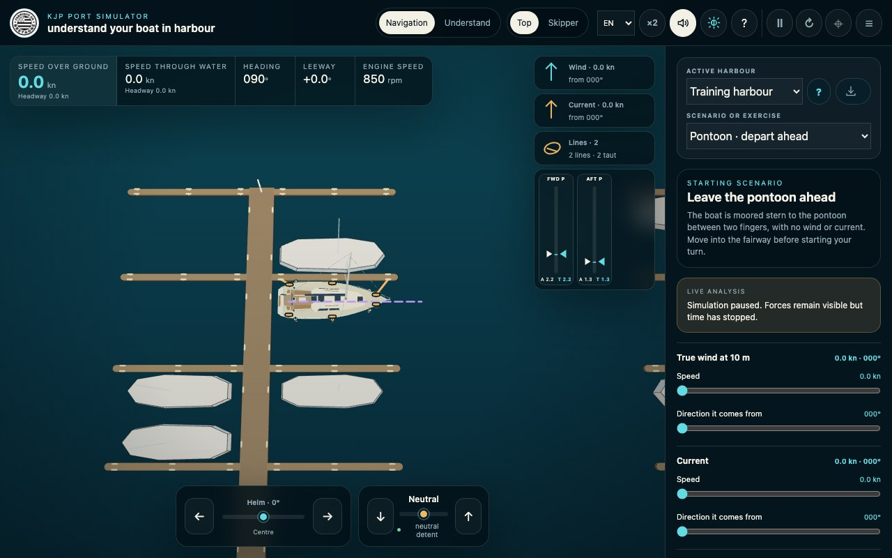
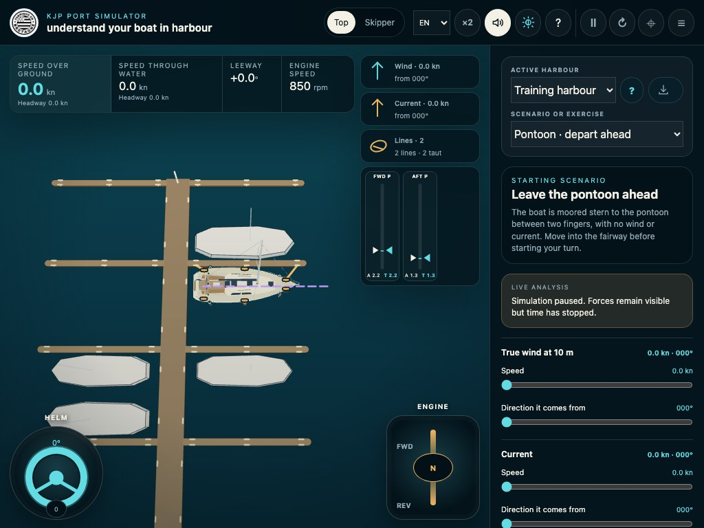
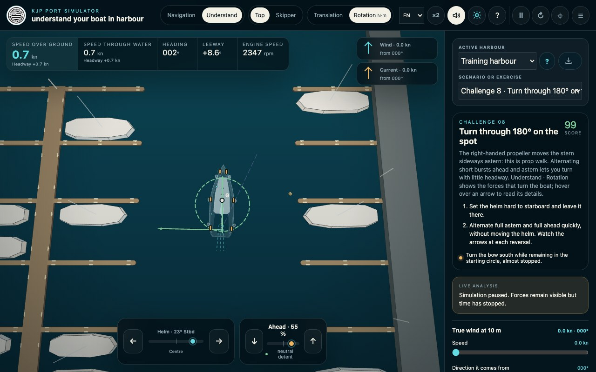
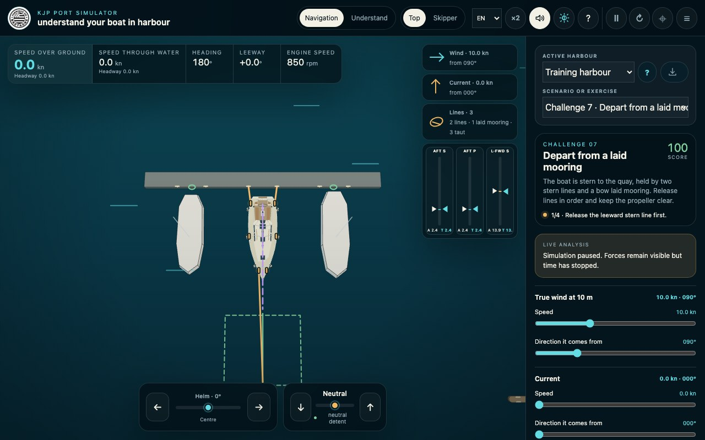

# Harbour manoeuvring with KJP Port Simulator

KJP Port Simulator lets you try a manoeuvre, observe the boat's response and repeat it as often as needed. It helps develop low-speed reference points, but does not replace an instructor or careful practice on your own boat.

## Finding your way around the interface

The central area shows the harbour and boat. Instruments at the top left display speeds, heading, leeway and engine speed. The top bar provides views, **Understand** mode, sound, light or dark theme, this guide, pause, restart and camera centring.

The right-hand panel contains the active harbour, scenario or exercise, instructions, live analysis, wind and current. The `☰` button shows or hides it. On tablets and phones it opens over the scene to leave more room for manoeuvring.

**Desktop view, with controls below the boat:**

## Choosing your language

The `FR / EN` selector in the top bar changes the whole interface and this guide immediately. Your first visit uses a supported browser language, or French if none matches. A manual choice is remembered when browser storage is available. Changing language preserves the current manoeuvre and settings. Names, comments and instructions supplied by the author of an imported harbour stay in their original language.

## Choosing controls for your screen

**On a computer:**

- `←` and `→` move the helm. It keeps its angle; **Centre** returns it to the centreline.
- `↑` or `Q` increase ahead throttle. `↓` or `W` increase astern throttle. You can hold throttle and helm keys together.
- To reverse gear, first return to neutral, release the key, then press again in the opposite direction.
- `Space` or `P` pauses or resumes. Lines can be handled while paused to represent a crew member's actions.
- `R` restarts the scenario.
- The wheel zooms. Drag to rotate the viewpoint; `Shift` + drag pans around the boat. Double-click the scene or use the centring button to restore the camera.

**On a tablet or phone:**

- Turn the **Helm** wheel at the bottom left. Tap `0` to centre it.
- Drag the **Engine** handle towards **FWD** or **REV**. Tap `N` for neutral.
- Pinch with two fingers to zoom. Move the same gesture to pan.
- Open settings with `☰`. Landscape orientation gives the best visibility on a phone.

**Tablet view with touch helm and engine controls:**

## Your first manoeuvre in five minutes

1. Open `simulateur-port.html` and keep the **Training harbour**.
2. Select **Pontoon · depart ahead**.
3. Release both lines by clicking or tapping their traces.
4. Apply a short burst ahead, then return to neutral. Observe inertia: the boat keeps moving.
5. Leave between the finger pontoons before turning. **Top** view is best for judging distances.
6. Repeat with some wind, then with current. Change only one condition at a time to feel its effect.

Instructions in the right-hand panel evolve during the manoeuvre. If you have difficulty, check **Live analysis** first: it may explain a lack of flow over the rudder, a loaded line or excessive speed towards the quay.

## Progressing through scenarios and challenges

The two pontoon departures and outer basin allow free experimentation. The nine challenges then provide a progression:

- **Challenge 1 · Master inertia**: gain headway, then stop in a precise area.
- **Challenges 2 and 3 · Berth to port and starboard**: prepare alignment, reduce headway and use the wind without being controlled by it.
- **Challenge 4 · Depart astern**: work with prop walk.
- **Challenge 5 · Leave on a spring**: turn against wind holding the boat on the finger pontoon.
- **Challenges 6 and 7 · Laid moorings**: berth stern to the quay, then leave with the line clear of the propeller.
- **Challenge 8 · Turn through 180° on the spot**: alternate short ahead and astern bursts to turn with little headway.
- **Challenge 9 · Reach your berth**: combine fairway navigation, approach, alignment and stopping.

The green outline or zone marks the objective. Scores mainly reward slow, precise arrivals without impacts. Some challenges offer a second level with stronger wind.

## Reading the boat's motion

- **Speed over ground**: speed relative to the quay, useful for judging an approach to an obstacle or cleat.
- **Speed through water**: speed relative to the water. If current carries the boat, it may be almost zero while speed over ground remains significant.
- **Headway**: the velocity component along the boat's axis, positive towards the bow and negative towards the stern.
- **Heading**: direction of the bow.
- **Leeway**: angle between the boat's axis and its movement through water.
- **Engine speed**: actual engine and shaft speed. It does not follow the command instantly, especially during gear reversals.

A useful example with current: a boat drifting sideways may show little headway because it moves little along its own axis, while keeping significant speed over ground relative to the quay.

**Top** view helps judge alignment and distances. **Skipper** view stays tied to the boat while allowing camera orientation. **×2** speeds up time; return to normal speed for a precise approach.

## Understanding why the boat turns or drifts

**Understand** mode displays forces acting on the boat, with two complementary readings:

- **Translation** shows each force at its application point. Arrow direction and length represent its direction and magnitude.
- **Rotation** highlights each force's effect on yaw. A long arrow means strong turning action even when the force itself is not the largest.

This distinction matters: a force near centre of mass `G` can move the boat strongly without turning it much. A smaller force applied far from `G`, at the rudder or a line for example, can have a large turning effect.

Hover over or tap an arrow to isolate its contribution. `+` means a tendency to turn to starboard; `−` means a tendency to turn to port. A dotted line joins `G` to the application point.

Wind appears through its effects on bow and stern. Current has no single thrust arrow: it changes flow received by the hull, keel and rudder, and therefore the forces shown on them.

**Rotation reading: arrow length represents the strength of the turning effect:**

## Using fenders, lines and laid moorings

To attach a line, click or tap a boat cleat, then a pontoon cleat, or start at the pontoon. The boat must move very slowly: with standard settings, attachment is allowed below **0.6 kn speed over ground**. If refused, return to neutral, let headway decrease and try again.

You can pause to represent a crew member's intervention: while paused, lines can be attached, adjusted or released.

A line may be slack, become taut and stretch under load. Drag its trace or gauge upwards to give slack, downwards to take it up. The right triangle shows target length; the left triangle shows actual length. Loaded lines change to warmer colours. Click or tap without dragging to release.

Fenders support the hull rather than brake it. They keep the hull off the quay while rolling and sliding along the pontoon. Aim for almost no velocity normal to the quay; analysis distinguishes gentle contact, contact too fast and severe impact.

For stern-to berthing, first control the stern with stern lines. Then tap the pickup loop at the quay and a free bow cleat. The light pickup line carries the laid mooring forward; the line connected to the anchor then becomes load-bearing. When departing, release it in neutral and wait until it is clear before engaging the propeller.

**Stern-to departure: two stern lines and one bow laid mooring:**

## Adjusting wind, current and the boat

Wind and current are defined by speed and the direction **they come from**. Start without disturbances, then add one condition at a time to identify its effect.

**Right-handed propeller** adjusts prop walk: astern it tends to push the stern to port. **Expert calibration** adjusts loaded mass, windage, rudder effectiveness, lateral resistance and the maximum speed allowed for line attachment. Keep defaults while learning, then change one setting at a time to represent another boat or situation.

## Understanding Expert calibration

**Expert calibration** studies the boat's sensitivity to important quantities. It does not change the stored profile or replace measurements on board: settings apply to the current simulation. For a fair comparison, change one slider only, restart the same scenario and keep the same wind, current, helm and engine command.

- **Loaded mass** — **5,700 to 7,800 kg**, default **6,500 kg**. Higher mass reduces acceleration from a given force and increases translational and rotational inertia.
- **Windage** — **60 to 140 %**, reference **100 %**. Multiplies wind forces and moments on exposed panels; it has no effect without wind.
- **Rudder effectiveness** — **60 to 140 %**, reference **100 %**. Multiplies hydrodynamic rudder action. The rudder still needs flow from headway or propeller wash to act.
- **Lateral resistance** — **60 to 140 %**, reference **100 %**. Higher values strengthen hull and keel resistance to sideways drift; they do not directly change current speed.
- **Prop walk · right-handed propeller** — **0 to 100 %**, default **60 %**. Adjusts the component mainly pushing the stern to port under astern power. Zero reduces this effect without removing the model's minimum transverse propeller component.
- **Attach a line below** — **0.1 to 1.0 kn**, default **0.6 kn**. This interaction threshold uses speed over ground to allow or refuse attachment; it does not physically slow the boat.

The extremes help understand trends or bracket uncertainty. They do not imply that a real boat corresponds to that combination. For the exact model, open [Explore the Sun Odyssey 36i physical model — French content](../output/modeles-physiques/explorer-les-modeles.html). It details the **Sun Odyssey 36i** windage panels, submerged hull and appendages, propeller, rudder wash, axes, positions and force conventions.

## Loading or restoring a harbour

**Active harbour** returns to the training harbour, loads La Trinité-sur-Mer or opens the harbour generator. The load button also accepts a `.kjp` file prepared with the generator.

The simulator validates the file before replacing the scene. The boat is placed at the author's entry point, in neutral with no wind or current. The small `?` beside the harbour opens nautical information; the `?` in the top bar opens this guide.

The loaded harbour stays in memory for the session only. Select **Training harbour** again to return to the learning environment.

## Why the behaviour is credible

The model aims for coherent low-speed nautical responses. The boat does not follow a scripted path: speed and orientation continuously result from engine, water, wind, contacts and lines.

- **A measured reference boat.** The main profile represents a Sun Odyssey 36i: **10.94 m** overall, **9.84 m** waterline, **3.59 m** beam, **1.94 m** draft. Displacement is **5.7 t** light and **6.5 t** loaded; estimated wetted area is **28.5 m²**. Loaded mass is an estimate with about **8 %** uncertainty, not an exact measurement.
- **An explicit operating domain.** Calibration targets harbour manoeuvres up to **4 kn through water**. Waves and hydrodynamic interaction with a quay are not simulated.
- **Mass, inertia and coupled motion.** The boat can advance, drift and turn together. Rotational inertia uses a **2.78 m** radius of gyration; water moving with the hull adds inertia, including **7.5 %** longitudinally, with transverse distribution along the hull. This explains continuing headway after neutral and turns that do not stop instantly.
- **Hull and keel distributed along the length.** Longitudinal and lateral hull forces are calculated over **11 sections** along the **9.84 m** waterline. The keel is separate, with **3.15 m²** area and **1.26 m** span; stall is gradual between **24° and 52°** incidence. The apparent pivot therefore moves with headway, drift and applied forces.
- **A complete propulsion chain.** The reference engine is a **21.3 kW Yanmar 3YM30**, **850 to 3,200 rpm**, with a KM2P-1 gearbox, ratio **2.62 ahead** and **3.06 astern**. Reversal disengages the clutch in **0.12 s**, holds neutral for **0.18 s**, then re-engages over **0.36 s**. Shaft and propeller retain inertia, so thrust does not reverse instantly.
- **A propeller in all four operating regimes.** The fixed, right-handed three-blade propeller has **406 mm** diameter and **279 mm** pitch. A **32-point** table covers thrust and torque in all four quadrants: normal propulsion, astern, braking during reversal and windmilling under water flow. Prop walk depends on actual propeller loading and is mainly noticeable under astern power.
- **A rudder divided across its flow.** The spade rudder has **0.82 m²** area and **1.18 m** span. Angle is limited to **35°**, movement to **52° per second**. **5 strips** each receive boat flow and, according to position, contracted and swirling propeller wash. Stall is gradual between **24° and 52°**. It can work at rest when hit by wash, but helm angle alone with no flow does not turn the boat.
- **Windage distributed over 36 panels.** **28 freeboard panels** join **15 measured longitudinal gunwale points** in 14 segments on each side, plus **4 coachroof panels**, **2 boom panels**, **1 mast and rigging panel** and **1 transom panel**. Each has area, orientation and position; apparent wind creates drift and yaw according to fore/aft loading. The vertical wind profile is referenced at **10 m**. Calibration represents a cruising sailboat with furled sails and **6 to 20 kn apparent wind**; geometry and coefficient uncertainty is about **20 %**.
- **Current as moving water.** Current is not a constant added push. Forces on the 11 hull sections, keel and rudder depend on velocity relative to water. Ground and water speeds can differ, and a boat stationary over ground still receives forces in current.
- **Local contacts.** The hull envelope has **30 contact points**: 26 side points, 3 transom points and 1 bow point, plus **6 fenders** fore, midships and aft on both sides. Each fender is **35 cm** in diameter with **1 cm** preload. Stiffness is **48 kN/m**, compared with **98 kN/m** for direct hull contact; longitudinal friction is **0.03**, compared with **0.30** for the hull. Fenders cushion approaches and slide more easily along pontoons.
- **Impact speed measured normal to the quay.** Contact is acceptable up to **0.20 m/s** (about **0.39 kn**), too fast from **0.20 to 0.40 m/s**, and severe above **0.40 m/s** (about **0.78 kn**). This is velocity towards the quay at the contact point, not the boat's ground speed. Continuous detection also prevents a fast hull passing through a pontoon between frames.
- **Elastic, unilateral lines.** A line pulls but never pushes. The reference **14 mm** polyester line reaches **15 % stretch** at **12 kN** working load, chosen as **30 %** of nominal **40 kN** breaking load, then stiffens progressively. Displayed stretch is capped at **20 %**. Each line can measure up to **20 m** and each boat cleat holds at most **2 lines**. Tension acts at the selected cleat: bow/stern lines, springs and breast lines have different lever arms and effects. Breaking and chafe are not simulated.
- **Bounded crew effort.** Total human hauling force is limited to **200 N** (about **20 kgf**), even when hauling several lines together. Slack is taken up at **1 m/s** and given at **1.2 m/s**; pulling fades when induced movement approaches **0.20 kn**. A laid mooring is first picked up with **100 N** preload, within **1.8 m** of the pickup and below **0.60 kn**, before carrying load. Hauling never teleports the boat.
- **Accelerated time with full physics.** Calculation uses fixed **1/120 s** steps, or **120 calculations per simulated second**. **×2** performs **240 steps per real second** without enlarging the step or removing hull, rudder, propeller, wind, current, contact or line effects.

Main dimensions and the engine/gearbox chain come from manufacturer data. Quantities requiring instrumented trials — hull, windage, contact and propeller coefficients — are identified as estimates or calibrations with validity domains and uncertainty. Their influence is checked by parameter variations and reference manoeuvres. The approach draws on [Fossen's marine model](https://www.fossen.biz/html/marineCraftModel.html), the [MMG standard](https://doi.org/10.1007/s00773-014-0293-y) and [ITTC](https://www.ittc.info/media/11868/75-02-06-03.pdf) validation procedures.

Project hosted at: [https://github.com/arnaud2moissac/KJP_Port_Simulator](https://github.com/arnaud2moissac/KJP_Port_Simulator)

More information: [https://arnaud2moissac.github.io/KJP_Port_Simulator/README.md](https://arnaud2moissac.github.io/KJP_Port_Simulator/README.md)

The simulator is not a detailed hydrodynamic study or a certified digital twin of your boat. Actual loading, waves, propeller condition, gusts and crew actions can strongly change a manoeuvre. Use it to explore assumptions and understand trends, then validate them slowly and carefully on board.
