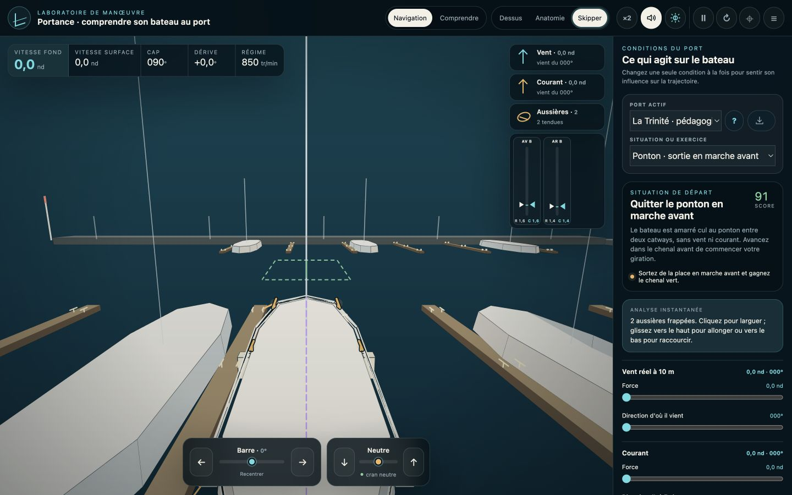
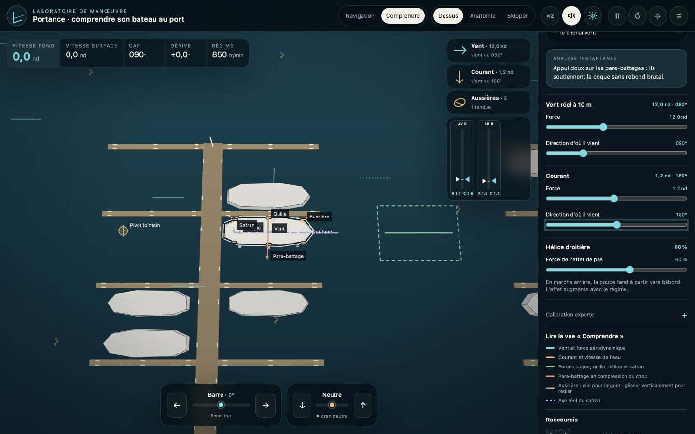
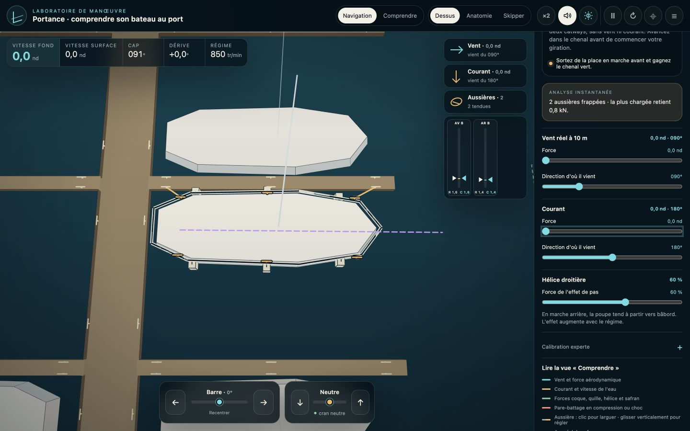

# Manœuvrer au port avec KJP Port Simulator

Le simulateur est conçu pour essayer, observer et recommencer. Il aide à construire des réflexes, mais ne remplace ni un moniteur, ni la pratique sur votre bateau.

## Une première manœuvre en cinq minutes

1. Ouvrez `simulateur-port.html` par double-clic.
2. Gardez le port pédagogique et choisissez **Ponton · sortie en marche avant**.
3. Cliquez sur les deux aussières pour les larguer.
4. Utilisez `↑` ou `Q` pour la marche avant, `↓` ou `W` pour la marche arrière. La commande s'arrête au neutre : relâchez puis appuyez de nouveau pour inverser.
5. Déplacez la barre avec `←` et `→`. Elle ne revient pas seule au milieu ; `Espace` la recentre.
6. Recommencez avec un peu de vent, puis avec du courant. Ne changez qu'un paramètre à la fois.

Les mêmes commandes sont disponibles sur écran tactile. La barre se règle en faisant glisser son curseur, comme un volant qui garde sa position.

## Lire ce que fait le bateau

- **Vitesse fond** : mouvement par rapport au quai. Elle est positive en marche avant et négative en marche arrière.
- **Vitesse surface** : mouvement longitudinal par rapport à l'eau. Dans un courant qui emporte le bateau avec lui, elle peut rester proche de zéro alors que la vitesse fond est non nulle.
- **Dérive** : angle entre l'axe du bateau et sa vitesse relative à l'eau.
- **Régime** : vitesse réelle du moteur, qui peut chuter quand l'hélice est fortement chargée.

La vue **Dessus** est la plus précise pour manœuvrer. **Anatomie** révèle quille, safran et hélice. **Skipper** conserve le regard orienté avec le bateau tout en laissant la caméra libre.

Le mode **Comprendre** superpose les efforts, le jet d'hélice, l'axe du safran et le point de pivot calculé. Les flèches indiquent des directions et des rapports de force ; elles ne constituent pas une mesure instrumentale.

## Pare-battages et aussières

Pour frapper une aussière, cliquez un taquet du bateau puis un taquet du ponton — ou dans l'ordre inverse. La vitesse fond doit rester sous la limite indiquée dans la calibration experte.

Une ligne peut rester molle, se tendre et s'allonger sous charge. Cliquez-glissez son tracé ou sa jauge pour régler sa longueur. Le triangle droit montre la consigne ; le triangle gauche montre la longueur réellement atteinte. Une ligne tendue prend une couleur chaude. Cliquez sans glisser pour la larguer.

Les pare-battages représentent un appui d'urgence, pas une permission de heurter le quai. Le diagnostic distingue contact doux, avertissement et choc sévère.

## Charger un port communautaire

Le bouton de chargement accepte un fichier `.kjp` produit par le générateur. Le port est validé avant de remplacer la scène, puis le bateau apparaît au point d'entrée défini par son auteur, au neutre, sans vent ni courant. Le bouton `?` affiche les informations du port.

Le fichier reste uniquement en mémoire. Revenez au port pédagogique avec le sélecteur **Port actif**.

## Pourquoi le comportement est crédible

Le modèle vise la cohérence nautique à basse vitesse plutôt qu'une reproduction spectaculaire :

- le bateau est un corps rigide plan à trois degrés de liberté — avance, dérive et lacet — avec sa masse, son inertie et les masses d'eau entraînées ;
- la résistance de coque est distribuée sur onze sections. La quille et le safran sont calculés séparément, si bien que le point de pivot résulte des forces au lieu d'être imposé ;
- le moteur, l'embrayage, l'arbre et l'hélice sont couplés. Le modèle quatre quadrants traite propulsion, inversion, crash-stop et moulinet ;
- le safran reçoit l'écoulement local du bateau et le jet convecté de l'hélice. Sans erre ni jet, il ne peut pas magiquement faire tourner le bateau ;
- le vent utilise plusieurs surfaces de fardage et leurs centres d'effort. Le courant agit sur la vitesse relative à l'eau et cesse donc de pousser une coque déjà entraînée à sa vitesse ;
- les contacts sont amortis et les aussières sont unilatérales et viscoélastiques : elles tirent, ne poussent jamais et restituent une énergie limitée par leur allongement ;
- le calcul est déterministe et intégré à 120 pas par seconde, sans simplification en mode ×2.

Le profil du Sun Odyssey 36i utilise les dimensions constructeur et un déplacement chargé d'environ 6,5 t. Les coefficients impossibles à connaître sans essais instrumentés sont identifiés comme estimations et testés par sensibilité. L'approche s'appuie notamment sur le [modèle marin 3-DOF de Fossen](https://www.fossen.biz/html/marineCraftModel.html), le [standard MMG](https://doi.org/10.1007/s00773-014-0293-y) et les procédures de validation de l'[ITTC](https://www.ittc.info/media/11868/75-02-06-03.pdf).

Ce n'est ni une CFD, ni un jumeau numérique certifié. Le chargement réel, les fonds, les vagues, l'état de l'hélice, les rafales et les gestes de l'équipage peuvent modifier fortement une manœuvre. Utilisez le simulateur pour préparer des hypothèses, puis validez-les lentement et prudemment à bord.
