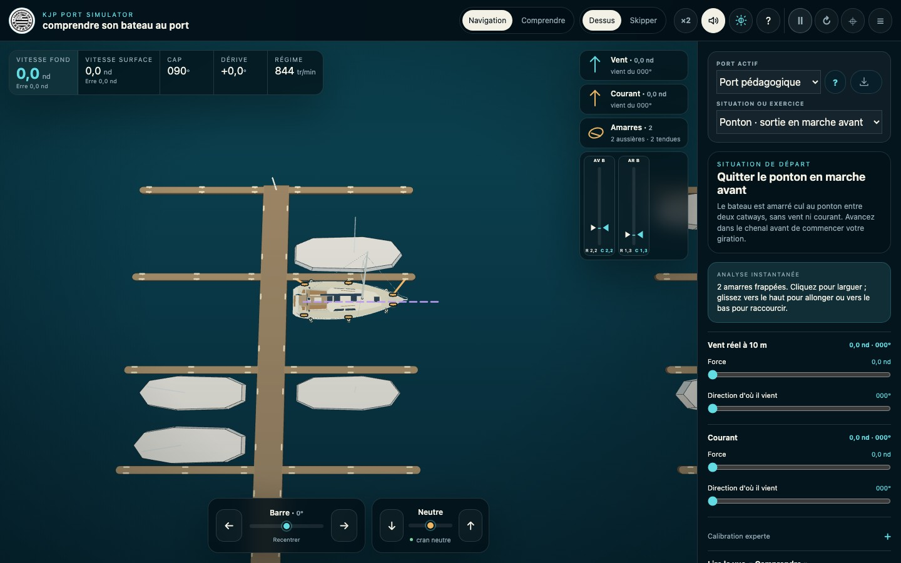
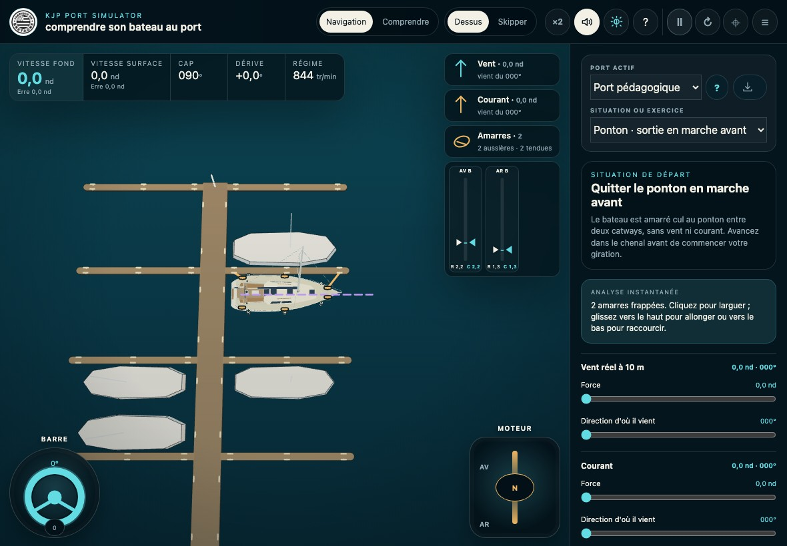
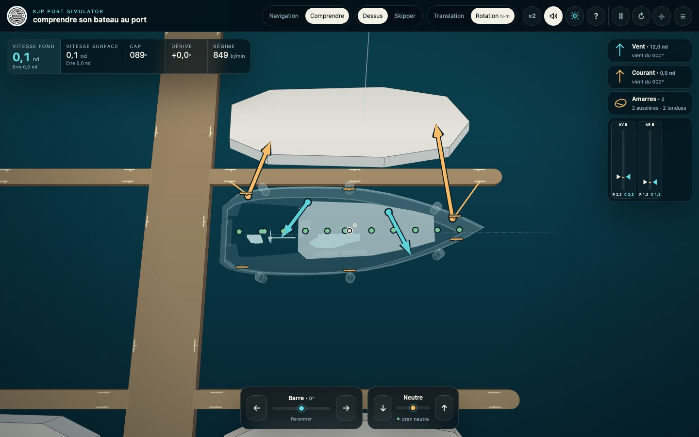
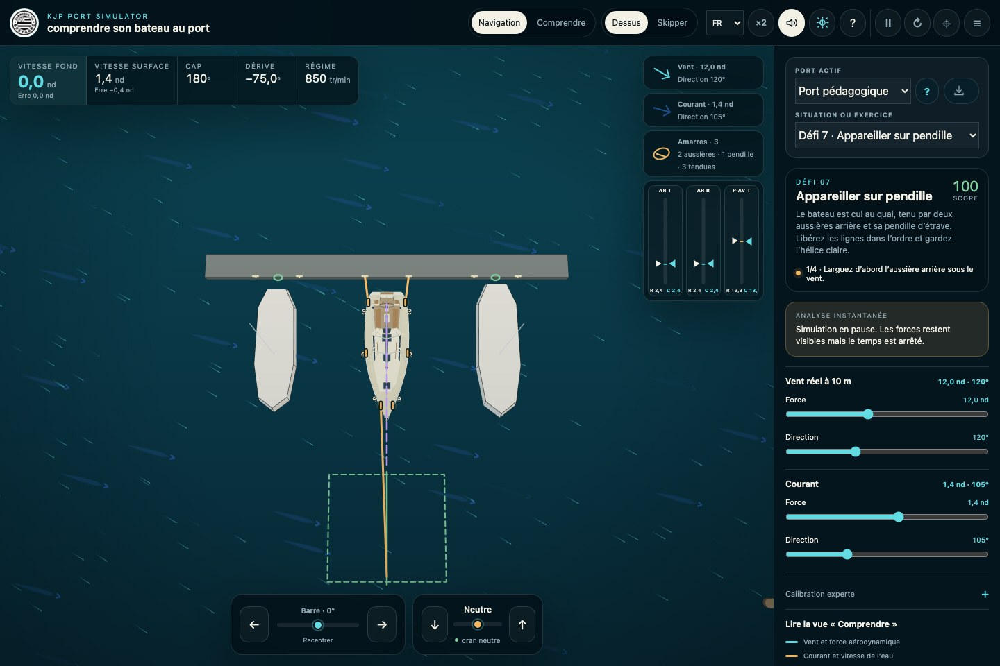

# Manœuvrer au port avec KJP Port Simulator

KJP Port Simulator permet d'essayer une manœuvre, d'observer la réaction du bateau et de recommencer autant de fois que nécessaire. Il aide à construire des repères à basse vitesse, mais ne remplace ni un moniteur, ni la pratique prudente sur votre bateau.

## Repérer l'interface

La zone centrale représente le port et le bateau. En haut à gauche, les instruments indiquent les vitesses, le cap, la dérive et le régime moteur. Le bandeau supérieur donne accès aux vues, au mode **Comprendre**, au son, au thème clair ou foncé, à cette aide, à la pause, au redémarrage de la situation et au recentrage de la caméra.

Le panneau de droite regroupe le port actif, la situation ou l'exercice, les consignes, l'analyse instantanée, le vent et le courant. Le bouton `☰` l'affiche ou le masque. Sur une tablette ou un téléphone, il s'ouvre par-dessus la scène afin de laisser davantage de place à la manœuvre.

**Vue sur ordinateur, avec les commandes sous le bateau :**

## Choisir les commandes adaptées à votre écran

Le sélecteur `FR / EN / Bzh` du bandeau supérieur change immédiatement la langue de l'interface et de ce guide : français, anglais ou breton. Au premier lancement, le simulateur utilise une langue compatible du navigateur, sinon le français. Le choix manuel est mémorisé lorsque le stockage du navigateur est disponible. Changer de langue conserve la manœuvre et les réglages en cours. Les noms, commentaires et consignes fournis par l'auteur d'un port importé restent dans leur langue d'origine.

**Sur ordinateur :**

- `←` et `→` déplacent la barre. Elle conserve son angle ; le bouton **Recentrer** la remet dans l'axe.
- `↑` ou `Q` augmentent la marche avant. `↓` ou `W` augmentent la marche arrière.
- Pour inverser la marche, revenez d'abord au neutre, relâchez la touche, puis appuyez de nouveau dans l'autre sens.
- `Espace` ou `P` met la simulation en pause ou la reprend. On peut manipuler les aussières pendant la pause pour "simuler" un équipier.
- `R` recommence la situation.
- La molette zoome. Un glisser fait pivoter le point de vue ; `Maj` + glisser déplace la carte autour du bateau. Un double-clic dans la scène ou le bouton de recentrage rétablit la caméra.

**Sur tablette ou téléphone :**

- Faites tourner la roue **Barre** en bas à gauche. Touchez `0` pour recentrer.
- Faites glisser la poignée **Moteur** vers **AV** ou **AR**. Touchez `N` pour revenir au neutre.
- Pincez avec deux doigts pour zoomer. Le même geste déplacé fait glisser la vue.
- Ouvrez les réglages avec `☰`. Sur un téléphone, le mode paysage offre la meilleure visibilité.

**Vue sur tablette, avec la roue de barre et la poignée moteur tactiles :**

## Réaliser une première manœuvre en cinq minutes

1. Ouvrez `simulateur-port.html` et gardez le **Port pédagogique**.
2. Choisissez **Ponton · sortie en marche avant**.
3. Larguez les deux aussières en cliquant ou en touchant leur tracé.
4. Donnez une courte impulsion en marche avant, puis revenez au neutre. Observez l'erre : le bateau continue à avancer.
5. Sortez entre les catways avant de commencer à tourner. La vue **Dessus** est la plus précise pour apprécier les distances.
6. Recommencez avec un peu de vent, puis avec du courant. Ne changez qu'une condition à la fois afin de sentir son effet.

Les consignes du panneau de droite évoluent pendant la manœuvre. En cas de difficulté, regardez d'abord l'**Analyse instantanée** : elle indique par exemple si le safran manque d'écoulement, si une aussière travaille ou si le contact avec le quai est trop rapide.

## Progresser avec les situations et les défis

Les deux sorties de ponton et le bassin extérieur servent à expérimenter librement. Les neuf défis proposent ensuite une progression :

- **Défi 1 · Dompter l'inertie** : prendre de l'erre puis s'arrêter dans une zone précise.
- **Défis 2 et 3 · Accostages bâbord et tribord** : préparer l'alignement, casser l'erre et utiliser le vent sans le subir.
- **Défi 4 · Sortie en marche arrière** : composer avec l'effet de pas de l'hélice.
- **Défi 5 · Sortir sur garde** : faire pivoter le bateau contre un vent qui le plaque au catway.
- **Défis 6 et 7 · Pendille** : accoster cul au quai, puis appareiller en gardant la ligne claire de l'hélice.
- **Défi 8 · Demi-tour sur place** : alterner de courtes poussées avant et arrière pour faire tourner le bateau avec peu d'erre.
- **Défi 9 · Rejoindre sa place** : enchaîner chenal, approche, alignement et arrêt au poste.

La silhouette ou la zone verte indique l'objectif. Le score récompense surtout une arrivée lente, précise et sans choc. Après certains défis, un second niveau ajoute davantage de vent.

## Lire ce que fait le bateau

- **Vitesse fond** : vitesse par rapport au quai. C'est elle qui permet de juger l'approche d'un obstacle ou d'un taquet.
- **Vitesse surface** : vitesse par rapport à l'eau. Si le courant emporte le bateau avec lui, elle peut être presque nulle alors que la vitesse fond reste visible.
- **Erre** : composante de la vitesse dans l'axe du bateau. Elle est positive vers l'étrave et négative vers la poupe.
- **Cap** : direction de l'étrave.
- **Dérive** : angle entre l'axe du bateau et son déplacement dans l'eau.
- **Régime** : vitesse réelle du moteur et de l'arbre. Elle ne suit pas instantanément la commande, surtout lors d'une inversion.

Un exemple utile avec du courant : un bateau qui dérive en travers peut afficher peu d'erre, car il avance peu dans son axe, tout en conservant une vitesse fond sensible par rapport au quai.

La vue **Dessus** facilite les alignements et les distances. La vue **Skipper** garde le regard lié au bateau tout en permettant d'orienter la caméra. Le mode **×2** accélère le temps ; revenez à la vitesse normale pour une approche fine.

## Comprendre pourquoi le bateau tourne ou dérive

Le mode **Comprendre** rend visibles les efforts qui agissent sur le bateau. Il propose deux lectures complémentaires :

- **Translation** montre chaque force à son point d'application. La direction et la longueur de la flèche représentent le sens et l'intensité de la force.
- **Rotation** met en avant l'effet de chaque force sur le lacet. Une longue flèche signifie que cette action fait fortement tourner le bateau, même si la force elle-même n'est pas la plus grande.

Cette différence est essentielle : une force proche du centre de masse `G` peut déplacer fortement le bateau sans beaucoup le faire tourner. Une force plus faible mais appliquée loin de `G`, au safran ou à une aussière par exemple, peut produire un effet de rotation important.

Survolez une flèche avec la souris, ou touchez-la, pour isoler sa contribution. Le signe `+` indique une tendance à tourner vers tribord et le signe `−` une tendance à tourner vers bâbord. Le trait pointillé relie `G` au point d'application.

Le vent apparaît par ses actions sur la proue et la poupe. Le courant ne possède pas de flèche de poussée unique : il modifie l'écoulement reçu par la coque, la quille et le safran, donc les forces affichées sur ces éléments.

**Lecture Rotation : la longueur des flèches représente l'importance de l'effet tournant :**

## Utiliser les pare-battages, les aussières et les pendilles

Pour frapper une aussière, cliquez ou touchez un taquet du bateau, puis un taquet du ponton — ou commencez par le ponton. Le bateau doit se déplacer très lentement : avec le réglage standard, la prise est autorisée en dessous de **0,6 nd de vitesse fond**. Si le simulateur refuse l'aussière, revenez au neutre, laissez tomber l'erre et réessayez.

Vous pouvez aussi mettre la simulation en pause pour représenter l'intervention d'un équipier : pendant la pause, on peut frapper, regler ou larguer une aussiere.

Une aussière peut rester molle, se tendre et s'allonger sous charge. Faites glisser son tracé ou sa jauge vers le haut pour donner du mou, vers le bas pour reprendre. Le triangle droit indique la longueur demandée ; le triangle gauche, la longueur réellement atteinte. Une ligne qui travaille prend une couleur plus chaude. Cliquez ou touchez une ligne sans la faire glisser pour la larguer.

Les pare-battages sont un appui, pas un frein. Ils écartent la coque du quai tout en roulant et en glissant le long du ponton. Cherchez donc un contact presque sans vitesse normale ; l'analyse distingue un appui doux, un contact trop rapide et un choc sévère.

Pour un amarrage cul au quai, commencez par contrôler la poupe avec les aussières arrière. Touchez ensuite la petite boucle de pendille au quai, puis un taquet libre à l'étrave. La ligne légère amène la pendille vers l'avant ; la ligne reliée au corps-mort devient alors porteuse. Au départ, larguez la pendille au neutre et attendez qu'elle soit claire avant d'engager l'hélice.

**Appareillage cul au quai : deux aussières arrière et une pendille d'étrave :**

## Régler le vent, le courant et le bateau

Le vent et le courant se règlent par leur force et par leur **direction de déplacement**. Les indications à l'écran et leurs flèches montrent ce même sens : 000° vers le nord, 090° vers l'est, 180° vers le sud et 270° vers l'ouest. Commencez sans perturbation, puis ajoutez une seule condition. Cette méthode permet d'attribuer la réaction observée à la bonne cause.

Le vent apparaît sous forme de filaments avec une traînée progressive ; le courant, sous forme de fuseaux translucides à pointe ouverte, sous le vent. Chaque champ est uniforme sur tout le plan d'eau. Les particules se déplacent à la vitesse du flux et suivent le temps de simulation : la pause les fige et ×2 accélère leur déplacement. Leur longueur est adaptée à la lisibilité. En thème clair, le vent est plus contrasté et le courant bleu adouci ; dans Comprendre, les deux sont atténués pour laisser les forces lisibles. Ces représentations ne changent pas le moteur physique.

Le réglage **Hélice droitière** dose l'effet de pas : en marche arrière, il tend à chasser la poupe vers bâbord. La section **Calibration experte** permet d'adapter la masse en charge, le fardage, l'efficacité du safran, la résistance latérale et la vitesse maximale autorisée pour frapper une aussière. Gardez les valeurs proposées pour découvrir le simulateur ; modifiez-les ensuite une par une pour représenter un bateau ou une situation différente.

## Comprendre la « Calibration experte »

La **Calibration experte** sert à étudier la sensibilité du bateau à quelques grandeurs importantes. Elle ne change pas le profil enregistré et ne remplace pas une mesure à bord : les réglages s'appliquent à la simulation en cours. Pour comparer proprement deux valeurs, ne déplacez qu'un curseur à la fois, recommencez la même situation et conservez le même vent, le même courant, la même barre et la même commande moteur.

- **Masse en charge** — de **5 700 à 7 800 kg**, avec **6 500 kg** comme valeur proposée. Une masse plus élevée réduit l'accélération produite par une même force et augmente l'inertie en translation comme en rotation.
- **Fardage** — de **60 à 140 %**, avec **100 %** comme référence. Ce coefficient multiplie les forces et les moments produits par le vent sur les panneaux exposés ; il n'a donc pas d'effet lorsqu'il n'y a pas de vent.
- **Efficacité du safran** — de **60 à 140 %**, avec **100 %** comme référence. Elle multiplie l'action hydrodynamique du safran. Le safran doit toujours recevoir un écoulement dû à l'erre ou au jet d'hélice pour agir.
- **Résistance latérale** — de **60 à 140 %**, avec **100 %** comme référence. Une valeur élevée renforce l'opposition de la coque et de la quille à la dérive ; elle ne modifie pas directement la vitesse du courant.
- **Effet de pas · hélice droitière** — de **0 à 100 %**, avec **60 %** comme valeur proposée. Il dose la composante réglable qui chasse surtout la poupe vers bâbord en marche arrière. La valeur 0 % réduit cet effet sans supprimer la composante transversale minimale du modèle d'hélice.
- **Frapper une aussière sous** — de **0,1 à 1,0 nd**, avec **0,6 nd** comme valeur proposée. C'est un seuil d'interaction fondé sur la vitesse fond : il autorise ou refuse la prise d'une aussière, mais ne ralentit pas physiquement le bateau.

Les extrêmes servent surtout à comprendre une tendance ou à encadrer une incertitude. Ils ne signifient pas qu'un bateau réel correspond nécessairement à cette combinaison de valeurs. Pour voir précisément ce que ces coefficients modulent, ouvrez [Explorer le modèle physique du Sun Odyssey 36i](../output/modeles-physiques/explorer-les-modeles.html). Cette page détaille le modèle utilisé pour le **Sun Odyssey 36i** : panneaux de fardage, coque et appendices immergés, hélice, jet sur le safran, axes, positions et conventions de forces.

## Charger ou retrouver un port

Le sélecteur **Port actif** permet de revenir au port pédagogique, de charger La Trinité-sur-Mer ou d'ouvrir le générateur de ports. Le bouton de chargement accepte aussi un fichier `.kjp` préparé avec le générateur.

Le simulateur vérifie le fichier avant de remplacer la scène. Le bateau est placé au point d'entrée prévu par l'auteur, au neutre, sans vent ni courant. Le petit bouton `?` situé à côté du port affiche les informations nautiques de ce port ; le `?` du bandeau supérieur ouvre le présent guide.

Le port chargé reste uniquement en mémoire pendant la session. Pour retrouver l'environnement d'apprentissage, choisissez de nouveau **Port pédagogique**.

## Pourquoi le comportement est crédible

Le modèle recherche une réaction nautique cohérente à basse vitesse, pas une animation spectaculaire. Le bateau ne suit aucune trajectoire pré-écrite : sa vitesse et son orientation résultent à chaque instant de l'ensemble des actions du moteur, de l'eau, du vent, des contacts et des amarres.

- **Un bateau de référence mesuré.** Le profil principal représente un Sun Odyssey 36i de **10,94 m** hors tout, **9,84 m** à la flottaison, **3,59 m** de large et **1,94 m** de tirant d'eau. Son déplacement est de **5,7 t** à lège et de **6,5 t** en charge, avec une surface mouillée estimée à **28,5 m²**. La masse en charge reste une estimation, annoncée avec une incertitude de l'ordre de **8 %** plutôt que présentée comme une mesure exacte.
- **Un domaine d'emploi explicite.** La calibration vise les manœuvres portuaires jusqu'à **4 nd de vitesse surface**. Les vagues et l'interaction hydrodynamique avec un quai ne sont pas simulées.
- **Masse, inertie et mouvements couplés.** Le bateau peut avancer, dériver et tourner en même temps. L'inertie de rotation est construite avec un rayon de giration de **2,78 m** ; l'eau entraînée par la coque ajoute aussi de l'inertie, notamment **7,5 %** en longitudinal, avec une répartition transversale le long de la coque. Cela explique l'erre qui subsiste après le passage au neutre et la giration qui ne s'arrête pas instantanément.
- **Coque et quille réparties sur la longueur.** La carène n'est pas ramenée à un unique point de résistance : ses efforts longitudinaux et latéraux sont calculés sur **11 sections** réparties le long des **9,84 m** de flottaison. La quille est un élément séparé de **3,15 m²** et **1,26 m** d'envergure ; son décrochage est rendu progressif entre **24° et 52°** d'incidence. Le point autour duquel le bateau semble pivoter se déplace donc avec l'erre, la dérive et les forces appliquées.
- **Une chaîne de propulsion complète.** Le moteur de référence est un **Yanmar 3YM30 de 21,3 kW**, de **850 à 3 200 tr/min**, associé à un inverseur KM2P-1 de rapport **2,62 en marche avant** et **3,06 en marche arrière**. Lors d'une inversion, l'embrayage se désengage en **0,12 s**, reste au neutre **0,18 s**, puis se réengage en **0,36 s**. L'arbre et l'hélice conservent leur inertie pendant cette séquence : l'inversion de poussée n'est donc pas instantanée.
- **Une hélice dans ses quatre régimes.** L'hélice est une tripale fixe droitière de **406 mm** de diamètre et **279 mm** de pas. Une table de **32 points** couvre les régimes de poussée et de couple dans les quatre quadrants : propulsion normale, marche arrière, freinage lors d'un renversement et moulinet lorsque l'eau entraîne l'hélice. L'effet de pas est lié à la charge réelle de l'hélice ; il devient donc surtout sensible en marche arrière sous puissance.
- **Un safran découpé dans son écoulement.** Le safran suspendu mesure **0,82 m²** pour **1,18 m** d'envergure. Son angle est limité à **35°** et sa vitesse de déplacement à **52° par seconde**. Il est calculé en **5 bandes** recevant chacune l'écoulement du bateau et, selon leur position, le jet contracté et tourbillonnaire de l'hélice. Son décrochage est progressif entre **24° et 52°**. Il peut ainsi agir au point fixe lorsque le jet d'hélice le frappe, mais une barre braquée sans erre ni jet ne fait pas tourner le bateau à elle seule.
- **Un fardage distribué sur 36 panneaux.** La prise au vent n'est pas concentrée au centre du bateau. Le modèle utilise **28 panneaux de franc-bord**, obtenus en reliant **15 points longitudinaux mesurés** sur le rail de fargue en 14 segments sur chacun des deux bords. S'y ajoutent **4 panneaux de rouf**, **2 de bôme**, **1 pour le mât et le gréement** et **1 pour le tableau arrière**. Chaque panneau possède sa surface, son orientation et sa position : le vent apparent produit ainsi à la fois une dérive et un moment de lacet réaliste selon qu'il porte davantage sur l'avant ou sur l'arrière. Le profil vertical est référencé à **10 m** de hauteur. Cette calibration correspond à un voilier de croisière sans toile, voiles ferlées, pour **6 à 20 nd de vent apparent** ; l'incertitude estimée sur la géométrie et les coefficients est de l'ordre de **20 %**.
- **Un courant traité comme un déplacement de l'eau.** Le courant n'est pas ajouté comme une poussée constante. Les efforts sur les 11 sections de coque, la quille et le safran dépendent de leur vitesse par rapport à l'eau. La vitesse fond peut donc différer de la vitesse surface, et un bateau immobile sur le fond continue de subir des efforts s'il y a du courant.
- **Des contacts localisés.** L'enveloppe de coque comporte **30 points de contact** — 26 sur les côtés, 3 au tableau arrière et 1 à l'étrave — auxquels s'ajoutent **6 pare-battages** : avant, milieu et arrière sur chaque bord. Chaque pare-battage mesure **35 cm** de diamètre et reçoit une précharge de **1 cm**. Sa raideur est de **48 kN/m**, contre **98 kN/m** pour un contact direct de coque ; son coefficient de frottement longitudinal est de **0,03**, contre **0,30** pour la coque. Il amortit donc l'approche et coulisse beaucoup plus facilement le long du ponton.
- **Une vitesse de choc mesurée normalement au quai.** Un contact est classé acceptable jusqu'à **0,20 m/s** — environ **0,39 nd** —, trop rapide entre **0,20 et 0,40 m/s**, puis sévère au-delà de **0,40 m/s**, soit environ **0,78 nd**. Il s'agit de la composante dirigée vers le quai au point de contact, pas de la vitesse fond du bateau. La détection continue évite aussi qu'une coque rapide traverse un ponton entre deux affichages.
- **Des aussières élastiques et unilatérales.** Une aussière peut tirer, jamais pousser. Le modèle de référence représente un cordage polyester de **14 mm** : il atteint **15 % d'allongement** sous une charge de travail de **12 kN**, choisie à **30 %** d'une charge de rupture nominale de **40 kN**, puis se raidit progressivement. L'allongement représenté est borné à **20 %**. Chaque ligne peut mesurer jusqu'à **20 m** et chaque taquet du bateau accepte au maximum **2 lignes**. La tension s'applique au taquet réellement choisi : une pointe, une garde ou une traversière n'ont donc ni le même bras de levier ni le même effet. La rupture et le ragage ne sont pas simulés.
- **Un équipage volontairement borné.** L'effort humain total disponible pour reprendre les lignes est limité à **200 N**, soit environ **20 kgf**, même lorsque plusieurs aussières sont reprises ensemble. Le mou est repris à **1 m/s** et donné à **1,2 m/s** ; la traction humaine s'efface lorsque le mouvement induit approche **0,20 nd**. Une pendille est d'abord reprise avec une précharge de **100 N**, à moins de **1,8 m** du point de prise et sous **0,60 nd**, avant de devenir porteuse. Reprendre une ligne ne téléporte donc jamais le bateau.
- **Un temps accéléré sans physique allégée.** Le calcul avance par pas fixes de **1/120 s**, soit **120 calculs par seconde simulée**. Le mode **×2** exécute **240 pas par seconde réelle** : il accélère la scène sans agrandir le pas de calcul ni supprimer les effets de coque, de safran, d'hélice, de vent, de courant, de contact ou d'aussières.

Les dimensions principales et la chaîne moteur–inverseur proviennent des données constructeur. Les grandeurs qui exigeraient des essais instrumentés — coefficients de coque, de fardage, de contact ou d'hélice — sont identifiées comme des estimations ou des calibrations, avec leur domaine de validité et leur incertitude. Leur influence est ensuite contrôlée par des variations de paramètres et des manœuvres de référence. L'approche s'appuie notamment sur le [modèle marin de Fossen](https://www.fossen.biz/html/marineCraftModel.html), le [standard MMG](https://doi.org/10.1007/s00773-014-0293-y) et les procédures de validation de l'[ITTC](https://www.ittc.info/media/11868/75-02-06-03.pdf).

Projet hébergé sur : [https://github.com/arnaud2moissac/KJP_Port_Simulator](https://github.com/arnaud2moissac/KJP_Port_Simulator)

Plus d'informations sur : [https://arnaud2moissac.github.io/KJP_Port_Simulator/README.md](https://arnaud2moissac.github.io/KJP_Port_Simulator/README.md)

Le simulateur n'est ni une étude hydrodynamique détaillée, ni un jumeau numérique certifié de votre bateau. Le chargement réel, les vagues, l'état de l'hélice, les rafales et les gestes de l'équipage peuvent modifier fortement une manœuvre. Utilisez-le pour préparer des hypothèses et comprendre des tendances, puis validez-les lentement et prudemment à bord.
